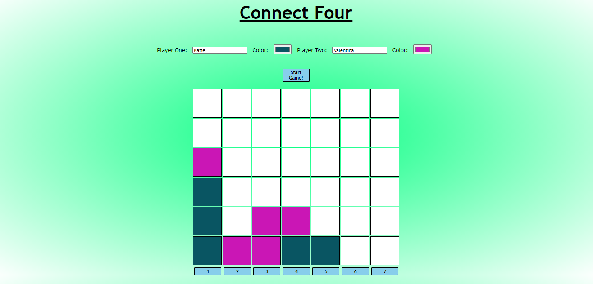

# Connect Four

#### School of Code Bootcamp - Hackathon Week 5

###### October 2020

_The Week 5 Hackathon challenge was to design and build our own game. It was an opportunity to cement everything we'd learnt that week about object oriented programming (OOP), as well as planning, ideating and coming up with an MVP. We had two days to work on this hackathon rather than the usual one day and we were working in pairs._

### Main Learning Points:

- I learnt a lot about OOP:
  - The two building blocks of Classes in Object Oriented Programming are State and Behaviours
  - Each Class in OOP should be responsible for changing its own properties
  - OOP allows for classes in a program to be easily re-used and scaled
  - It helps to build code that can be easily maintained and modified
  - It helps to conceptualise programming problems by breaking them down into
    separate parts
- We used Trello for the first time on a Hackathon to create a Kanban board which helped us to plan our work flow, prioritise tasks and manage our time
- We learnt the importance of breaking a game down to it's essence and making the MVP as simple as it can be to function. We had to plan which classes the game needed and what state and behaviours each class would need. Then we broke each of the behaviours down to a level were we could start coding.
- After completing the MVP and starting work on the MLP tasks, take the time to think about which functionality would make the biggest impact on the user and start with that first.
- As part of our MLP we added buttons to the bottom of the grid which were used to select the column rather than prompt. This was interesting as it turned the game from being loop driven to event driven.

### Stretch Goals:

- Create and implement an algorithm which will find the winner
