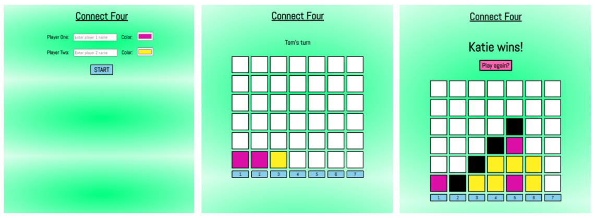

# Connect Four

#### School of Code Bootcamp - Hackathon Week 5

##### February 2021

_I refactored this app to improve the user experience, make it more robust and better implement SOLID principles. Changes I made:_

- _I implemented a winner algorithm which checks for four squares of the same color in a row after every turn. If it finds a winner it changes the color of the winning line of squares (so it's easy to see) and displays a winner message_
- _I did some general refactoring and got rid of the repetition I had in my code_
- _I got rid of the alerts and instead used the DOM to send messages to the players_
- _I made the game more robust and less breakable by:_
  - _only making the grid appear after the players have pressed start_
  - _getting rid of the player inputs once the game has begun_
  - _adding default colors and names to the inputs (Player 1 and Player 2) in case the players don't enter their details_
  - _once someone has won the game the event listeners on the buttons are disabled so the game play cannot continue_
- _I added a Play Again button which allows players to have a rematch_
- _I tried to give each method and class single responsibility which led to the refactoring of some of the methods on game - (implementing the S of SOLID)_
- _I tried to invert the dependencies of each class eg. grid is now handed to game's constructor, and this allows me to test and mock more easily - (implementing the D of SOLID)_
- _My next aim is to write tests!_

##### October 2020

_The Week 5 Hackathon challenge was to design and build our own game. It was an opportunity to cement everything we'd learnt that week about object oriented programming (OOP), as well as planning, ideating and coming up with an MVP. We had two days to work on this hackathon rather than the usual one day and we were working in pairs._

## Main Learning Points:

- I learnt a lot about OOP:
  - The two building blocks of Classes in Object Oriented Programming are State and Behaviours
  - Each Class in OOP should be responsible for changing its own properties
  - OOP allows for classes in a program to be easily re-used and scaled
  - It helps to build code that can be easily maintained and modified
  - It helps to conceptualise programming problems by breaking them down into
    separate parts
- We used Trello for the first time on a Hackathon to create a Kanban board which helped us to plan our work flow, prioritise tasks and manage our time
- We learnt the importance of breaking a game down to it's essence and making the MVP as simple as it can be to function. We had to plan which classes the game needed and what state and behaviours each class would need. Then we broke each of the behaviours down to a level were we could start coding.
- After completing the MVP and starting work on the MLP tasks, take the time to think about which functionality would make the biggest impact on the user and start with that first.
- As part of our MLP we added buttons to the bottom of the grid which were used to select the column rather than prompt. This was interesting as it turned the game from being loop driven to event driven.

## Stretch Goals:

- ✅ Create and implement an algorithm which will find the winner
- Write tests

## Built with:

- HTML
- CSS
- JavaScript
- OOP principles

## Getting Started:

Clone the repo as instructed below

## Prerequisites:

No prerequisites

## Installation

1.  Clone the repo

`git clone https://github.com/katiehawcutt/connect-four.git`

2. Run the index.html in a browser

## Usage

1. Enter player names and color choices
2. Press start
3. A player will be instructed to go first
4. Play the game!
